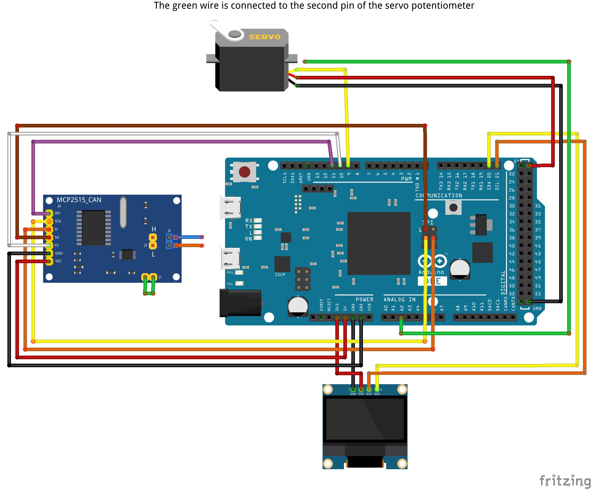

## Active Grille Shutter
Arduino Due project for Active Grille Shutter (AGS) control.

The project was made for a Honda CR-V 5 gen with a 2.4l engine in a configuration without AGS.

Due to circumstances, the project did not get into production, there was no longer a need for it. This is a beta version of the project, in which a lot can be optimized and/or rewritten.

The shutter opening and closing algorithm is primitive and solves the problem of faster engine heating in cold weather.

Added code to close curtains at high speed to increase vehicle aerodynamics. The code for closing the curtains at high speed has not been tested and needs optimization:
- selection of the maximum temperature for opening the curtains
- selection of vehicle speed for closing
- the delay between opening and closing the shutters at high speed

### Libraries for Arduino IDE:
- [Adafruit GFX Library](https://github.com/adafruit/Adafruit-GFX-Library)
- [Adafruit_SSD1306](https://github.com/adafruit/Adafruit_SSD1306)
- [CAN BUS Shield](https://github.com/Seeed-Studio/CAN_BUS_Shield)
- [Servo](https://www.arduino.cc/reference/en/libraries/servo/)
- [SPI](https://www.arduino.cc/en/reference/SPI)

### Hardware:
- Arduino Due
- Sparkfun S05NF (micro) with upgrade
- 0.96" OLED Display Module 128X64 I2C
- CAN Module MCP2515
- Dupont wires
- Breadboard
- Micro USB Cable
- DC 9V 1A Power Supply Adapter 5.5x2.1mm

